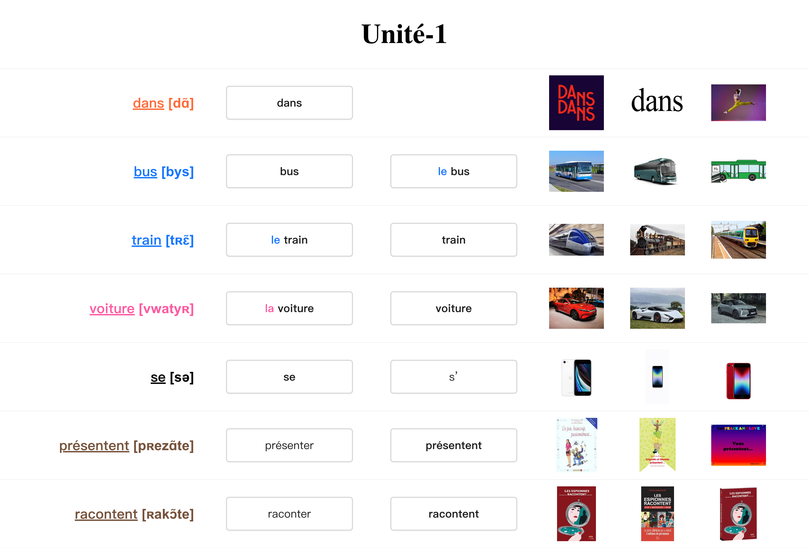

# A words learning tool for French learners  

### Features

1. You can custom your own French words list.
2. Each word has its phonetic alphabet and pronunciation.
3. Each word has associated images to deep your memory.
4. We use different colors to represent properties and gender.

### Words list

https://vincent1230.github.io/my-francais-words/#/nationalit%C3%A9

https://vincent1230.github.io/my-francais-words/#/unit%C3%A9-1

https://vincent1230.github.io/my-francais-words/#/unit%C3%A9-2

so on ...

### How to run

1. run `yarn`
2. apply a google images search key: https://serper.dev/
3. add .env file, put `SERPER_API_KEY="your_key"` in .env
4. run `yarn fetch`
5. run `yarn start`

### Deploy

`yarn deploy`

ref: https://github.com/gitname/react-gh-pages

### Contact me

Email: [gaobing1230@gmail.com](mailto:gaobing1230@gmail.com)

# License

### GNU GPL v3 

